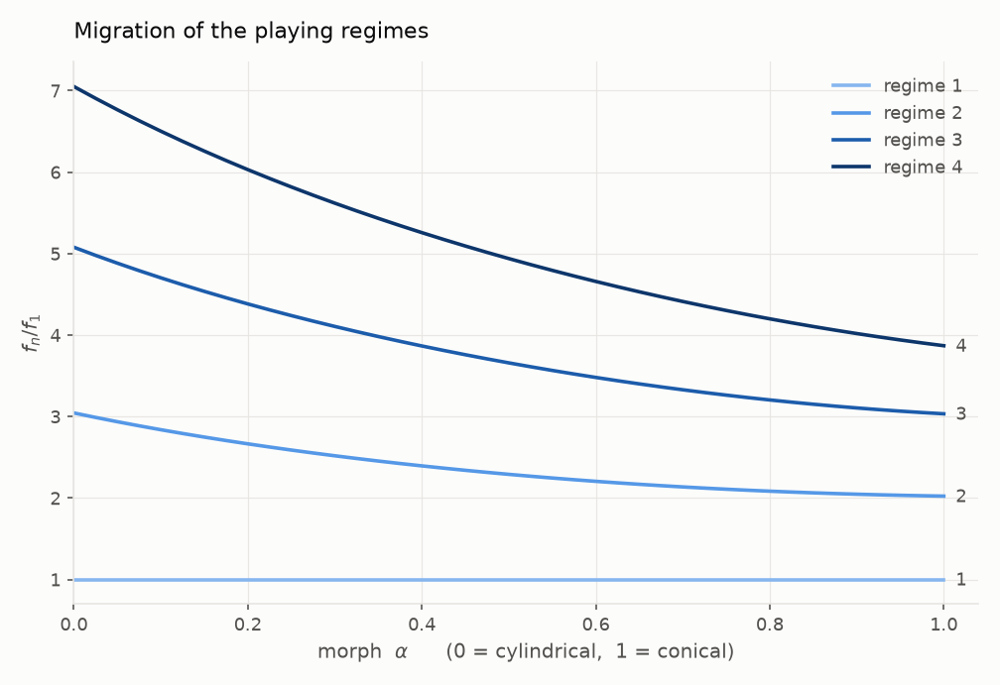
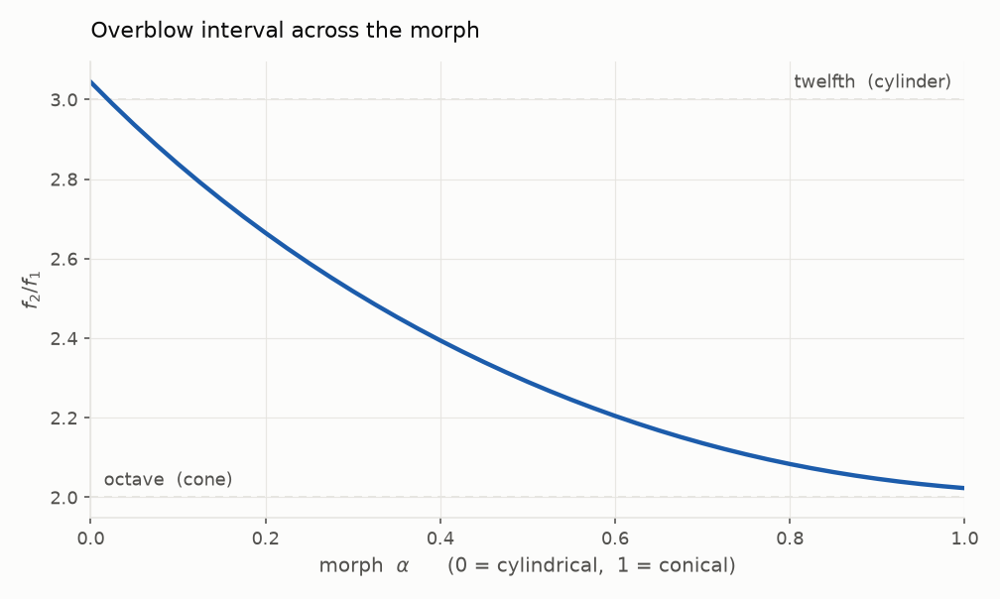
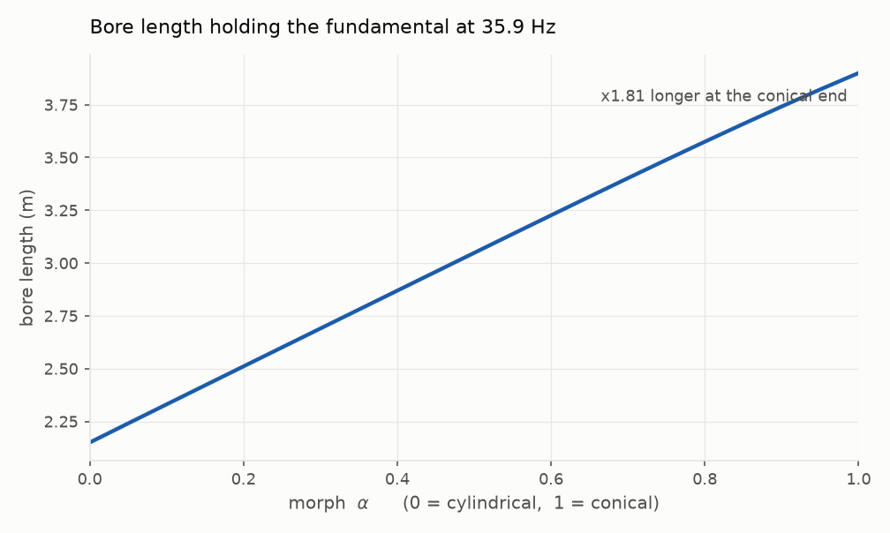
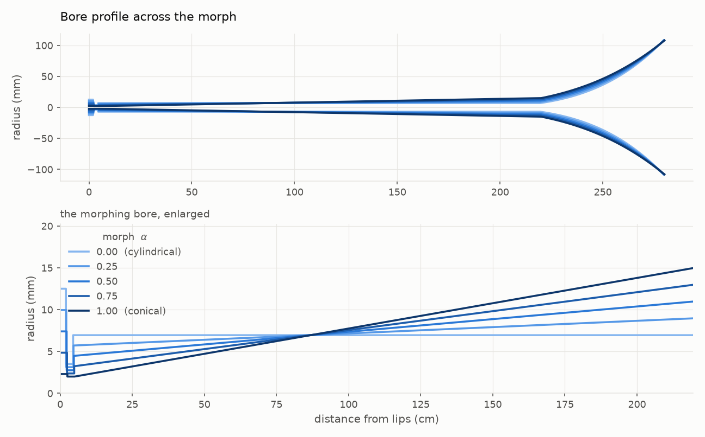

# Trombolese

A physical-modelling wind instrument that crosses a trombone with an oboe, with
one twist neither parent has: the bore itself is a continuous control. A single
parameter morphs it from a cylinder to a cone while the instrument is playing,
which changes not just its timbre but *which pitches it can sound*.

This repository is **stage 1**: an offline acoustic model, in NumPy, that works
out what the geometry actually does before any of it is committed to realtime
DSP. It answers one question — where does this bore resonate, and how does the
morph move those resonances — accurately enough to design a waveguide against.

## Why a bore morph is the interesting parameter

A cylindrical tube driven at a closed end resonates on **odd harmonics** and
overblows at the **twelfth**. A cone resonates on the **complete harmonic
series** and overblows at the **octave**. Those are different instrument
families, and no physical wind instrument can travel between them: the bore is
brass, and brass does not move.

Here it does, continuously, as a playable parameter.



At `alpha = 0` the resonances sit at 1, 3, 5, 7 times the fundamental — the
odd-harmonic signature of a closed cylinder. At `alpha = 1` they have migrated
to 1, 2, 3, 4. Every position in between is playable, and the transition is
smooth and monotonic rather than a jump between two states.

The overblow interval — what you get when you tighten your lip rather than move
the slide — travels from a twelfth to an octave:



## Results

At 20 °C, with the slide closed and pitch compensation on:

| alpha | throat | truncation | bore length | f₁ (Hz) | f₂/f₁ | regime ratios |
|------:|-------:|-----------:|------------:|--------:|------:|---------------|
| 0.00 | 6.95 mm | — | 2.15 m | 35.85 | 3.044 | 1, 3.04, 5.08, 7.05 |
| 0.25 | 5.71 mm | 0.637 | 2.60 m | 35.85 | 2.599 | 1, 2.60, 4.27, 5.93 |
| 0.50 | 4.47 mm | 0.408 | 3.05 m | 35.85 | 2.310 | 1, 2.31, 3.72, 5.14 |
| 0.75 | 3.24 mm | 0.249 | 3.49 m | 35.85 | 2.132 | 1, 2.13, 3.34, 4.57 |
| 1.00 | 2.00 mm | 0.133 | 3.90 m | 35.85 | 2.045 | 1, 2.05, 3.12, 4.21 |

## Pitch neutrality, and the gesture it buys

Left alone, the morph is not pitch-neutral: a cone sounds its fundamental near
`c / 2L` where a cylinder of the same length sounds `c / 4L`, so turning the
bore conical lifts the pitch by most of an octave. `compensate_pitch` solves,
at each morph position, for the bore length that puts the fundamental back
where it started — holding it to **0.00 cents** across the whole sweep.



The instrument has to grow by a factor of 1.81 to manage it, from 2.80 m
overall at the cylindrical end to 4.55 m at the conical one.

Compensation is safe, and provably so: the cone's truncation ratio works out to
be just the ratio of its two end radii, with the length cancelling entirely. So
lengthening the bore moves every resonance together and cannot rearrange them —
it shifts pitch without touching harmonicity.

### Only one regime can be held, so hold the one being played

Compensating for the fundamental is not enough, and the model said so the first
time the gesture was rendered: the note jumped between partials instead of
holding. The reason is structural. The morph exists precisely to change the
*ratios* between regimes — 1, 3, 5, 7 becoming 1, 2, 3, 4 — so holding all of
them still is a contradiction in terms. Pin the fundamental and the second
regime still slides from 3.04 times it down to 2.05, well over an octave, and a
player sustaining a note up there hears it lurch.

So `compensate_pitch` takes a `regime` argument, and it should be the regime
actually being played. Holding the third gives an instrument that stays put in
a normal register:

| alpha | bore length | f₁ | f₂ | **f₃** |
|------:|------------:|----:|----:|-------:|
| 0.00 | 2.150 m | 35.85 | 109.14 | **182.07** |
| 0.50 | 2.173 m | 49.73 | 113.94 | **182.07** |
| 1.00 | 2.312 m | 59.64 | 120.89 | **182.07** |

That also costs far less instrument: 7.5% of extra length rather than 81%.

What it buys is the defining gesture. With the played regime pinned, `alpha`
becomes a purely timbral control and the bore can be swept *while a note
sustains* — the pitch staying put while the spectrum around it transforms from
a cylinder's odd harmonics into a cone's full series. Rendered, it holds within
about 35 cents across the whole sweep. Nothing made of brass can do that.

## Two things the geometry got wrong on the first pass

Both were found by sweeping the model and noticing the resonances did not move
the way the textbook says they should. They are design constraints on the
instrument, not incidental bugs, and they are the main reason this stage exists
at all — both would have been far more expensive to discover in DSP.

**1. The throat cannot carry a long cylindrical section.** The first version
kept a trombone's 0.55 m cylindrical slide, at the throat radius, ahead of the
taper. A truncated cone only behaves like a complete one if whatever replaces
its missing apex has roughly the volume of that apex; 0.55 m of narrow tube has
several times too much, and acts as a transmission line rather than a
compliance besides. The result was an instrument whose upper resonances ignored
the morph completely — only the fundamental moved. The slide is now part of the
taper itself.

**2. A cone cannot reach the bell at a trombone's bore radius.** Opening from
2 mm to 6.95 mm over 2.15 m truncates the cone at 29% of its apex distance, far
too stubby for a harmonic series: the regimes come out at 1, 2.21, 3.51 instead
of 1, 2, 3. Reaching 15 mm instead puts the truncation at 13% and the regimes
at 1, 2.05, 3.14. **The conical limit of this instrument is therefore
necessarily wider-bored than its cylindrical limit** — nearer a euphonium than
a trombone. The bell's *mouth* stays fixed at 108 mm so the radiating aperture,
and hence the radiation impedance, is constant across the morph; only the
bell's entry follows the bore.



## Running it

```bash
pip install -e ".[dev]"
python scripts/explore_morph.py          # table + figures into out/
python scripts/render_audio.py           # audio demos into audio/
python scripts/explore_morph.py --uncompensated   # let the morph move the pitch
python scripts/explore_morph.py --slide 0.3 --no-figures
pytest
```

As a library:

```python
import numpy as np
from trombolese import Trombolese, find_resonances, pitch_neutral, scan_morph

instrument = pitch_neutral(Trombolese())   # omit for raw geometry
freqs = np.linspace(20.0, 900.0, 20_000)

regimes = find_resonances(instrument.response(freqs, alpha=0.5), fmax=900.0)
print(regimes.freqs, regimes.overblow_ratio)

scan = scan_morph(instrument, freqs)      # the whole sweep at once
```

Every geometric parameter is a field on `Trombolese`, so alternative
instruments are a constructor call:

```python
Trombolese(bore_length=1.2, cone_bell_entry_radius=0.022, bell_radius=0.06)
```

## How it works

The bore is a chain of cylindrical and conical frusta. Each gets a 2×2 transfer
matrix relating pressure and volume flow at its input to those at its output;
chaining is a matrix product, and the input impedance follows from the
radiation impedance at the mouth. Everything is vectorised over frequency.

Peaks of `|Z_in|` are the playing regimes: both a lip reed and a double reed
are pressure-controlled valves behaving close to a flow source, so they
cooperate with *maxima* of input impedance.

Two implementation notes worth keeping:

- The conical matrix is **built from the spherical-wave solutions rather than
  transcribed**. Collecting the two independent solutions into a basis matrix
  `V(x)` gives the segment matrix as `V(x1) V(x2)⁻¹` directly, which is harder
  to get wrong than a memorised closed form, handles contracting cones with no
  special case, and is checked against the cylindrical limit in the tests.
  Referencing the exponentials to the segment's own start, rather than to the
  apex, is what stops a gently tapered segment — whose apex may be kilometres
  away — from overflowing.
- Resonance peaks are refined by **parabolic interpolation**, which matters more
  than grid density: a 10,000-point grid then agrees with an 80,000-point one to
  0.002 cents, at an eighth of the cost.

## What this model does not include

These bound how far the numbers should be trusted. None of them move the
resonance frequencies much, which is what this stage is for, but several matter
a great deal for stage 2.

- **No excitation.** There is no reed, no lip, no breath. This is the resonator
  alone — it says where the instrument *wants* to oscillate, not what comes out.
  The lip-reed-to-double-reed morph is stage 2's problem.
- **Plane and spherical waves only.** No higher-order transverse modes. Safe
  below roughly 14 kHz for the bore, but it degrades inside the bell flare.
- **A crude mouthpiece.** Two cylinders — a cup and a throat — collapsing toward
  a reed staple as the bore turns conical. A real mouthpiece is what pulls a
  brass instrument's stretched modes into an almost-harmonic series, so leaving
  it out would misrepresent the trombone limit; two cylinders get the broad
  effect and not the detail.
- **An approximate radiation impedance.** Exact in the low- and high-frequency
  limits, an engineering fit between them. A waveguide implementation will want
  a proper reflection-function fit.
- **No nonlinear propagation.** At trombone dynamics, nonlinear steepening is a
  large part of the brassy timbre. It barely moves the resonance frequencies,
  so it is deferred — but it is not optional if you want this to *sound* like a
  trombone at forte.
- **No tone holes and no wall vibration.**

# Stage 2 — the sounding instrument

The resonator is a **Kelly–Lochbaum scattering ladder**: the bore sliced into
cylindrical sections one sample of propagation long, with pressure waves
travelling both ways and scattering wherever the cross-section changes.

Most waveguide brass models use one delay-line pair and a lumped reflection
filter standing in for the whole bell. That is much cheaper, and right when the
bore is fixed — but it hides the bore shape inside a filter fit, which is
exactly the thing that has to vary here. A ladder keeps the geometry explicit:
the shape *is* the coefficient vector, so morphing is a control-rate
recomputation and nothing else.

## Getting the waveguide to agree with stage 1

The ladder started out **25–60 cents sharp** at every regime. Three hypotheses
died before the right one:

- *Spatial discretisation?* No — the error did not shrink from 48 kHz to
  384 kHz.
- *The mouthpiece's tiny features?* No — removing it changed nothing.
- *The bell's stepped-cylinder approximation?* No — removing the bell left the
  error intact.

It was the **boundary-layer phase-velocity correction**. Stage 1's complex
wavenumber has `Re(k) = ω/c + α`, so waves travel a few percent *slower* than
`c` and every resonance sits correspondingly flat. A plain ladder propagates at
exactly `c`. Predicted error at f₁: 65.6 cents. Measured: 68.3.

The correction has to be **distributed, not lumped** — a second thing the model
had to be asked twice. Folding it into the termination did nothing for the low
regimes, because at low frequency the bell reflects the wave long before it
reaches the mouth, so a delay at the mouth is never traversed. Moved into every
section, as a one-pole carrying that section's share of the delay, the f₁ error
fell from +61 cents to −3.

The radiation **end correction** matters for the same reason and in the same
direction: `0.6133 a` is 66 mm on this bell, 2.4% of the instrument.

With both in place the ladder reproduces the design:

| alpha | f₂/f₁ (stage 1) | f₂/f₁ (waveguide) | f₃/f₁ (stage 1) | f₃/f₁ (waveguide) |
|------:|----------------:|------------------:|----------------:|------------------:|
| 0.00 | 3.044 | 2.995 | 5.078 | 4.972 |
| 0.50 | 2.310 | 2.295 | 3.716 | 3.678 |
| 1.00 | 2.045 | 2.044 | 3.120 | 3.119 |

Absolute frequencies still differ by up to about 30 cents, because a one-pole's
group delay is flat where the true excess delay falls as `1/√f`. Since the
waveguide *is* the instrument, the instrument is what gets tuned:
`tune_to_waveguide` re-solves the compensation against the ladder's own
resonances, holding the played regime to within a couple of cents.

## The excitation

Brass lips are **outward-striking** — pressure blows them open. A double reed is
**inward-striking** — the same pressure blows it shut. Nearly everything that
separates how the two families speak follows from that one sign, so the reed
morph is that sign made continuous: `beta` runs 0 → 1 and the coupling runs
+1 → −1, passing through a valve that barely responds to pressure at all.

`beta` is independent of `alpha`, so a double reed can go on a cylinder or
brass lips on a cone — pairings no instrument family has ever had to decide
about.

Flow and pressure define each other through the bore's impedance, so the pair
is solved **exactly, as a quadratic**, rather than iterated or guessed from the
previous sample; that is what keeps it stable when blown hard.

Two findings from getting it to play at all, both now in the code as warnings:

- **Below about Q = 7 the valve does not oscillate**, it only rings down from
  the attack. The first version was silent-but-plausible for this reason.
- **The closing pressure must stay well above the blowing pressure.** When it
  does not, the valve slams into its end stops every cycle and degenerates into
  a relaxation oscillator the bore alone controls — at which point the
  embouchure stops selecting regimes and the instrument is unplayable. This was
  the difference between lip = 108 Hz producing 255 Hz and producing 115 Hz.

What comes out behaves like a wind instrument: it self-sustains, it gets louder
*and brighter* with breath (spectral centroid 116 → 392 Hz across the dynamic
range), the embouchure lips it up through the partials, silence sits between
the partials where no regime is available, and running the slide out under a
held embouchure eventually **cracks the note up to the next partial**, exactly
as a trombone does.

## Hear it

`python scripts/render_audio.py` writes five files to `audio/`, and a sixth
with `--tune-reed`:

| file | what it demonstrates |
|------|----------------------|
| `bore-glissando.wav` | **the gesture** — one held note, bore morphing underneath it at constant pitch |
| `brass-regimes.wav` | lipping up through the partials at the cylindrical end |
| `crescendo.wav` | the spectrum opening up with breath |
| `reed-morph.wav` | lips toward double reed at a fixed bore |
| `slide.wav` | ordinary continuous pitch, for reference |
| `reed-morph-tuned.wav` | the same reed sweep with its pitch compensated (`--tune-reed`) |

# Playing an instrument that does not exist

Two of the five controls have no precedent, and no existing technique or
notation covers them. That is a design problem in its own right, not something
a MIDI mapping settles.

| control | precedent | what it does |
|---------|-----------|--------------|
| breath | universal | loudness, brightness, whether it speaks |
| embouchure | brass | selects which regime sounds |
| slide | trombone | continuous pitch |
| **`alpha`** | **none** | cylinder ↔ cone: *which partials exist* |
| **`beta`** | **none** | lips ↔ double reed: how the note starts and holds |

## What makes these genuinely new

`alpha` is not a filter sweep. A filter changes the balance of partials that
are already there; `alpha` changes **which partials the instrument is capable
of sounding**. Sweeping it under a held note moves the odd-harmonic series of a
cylinder into the complete series of a cone, so partials that did not exist
fade in and the note's identity changes while its pitch does not. The nearest
familiar thing is a vowel morph on a voice — and even that is a filter.

It also has a consequence with no analogue at all: because `alpha` moves the
regimes relative to one another, a player holding a fixed embouchure while
sweeping it will at some point find the regime beneath them has walked away,
and the note **jumps to a neighbouring partial**. That is an overblow triggered
by geometry rather than by embouchure — a *bore break*. It is a new articulation,
and it is controllable, because the model says exactly where in the sweep it
happens.

## Proposed control surface

**MPE keyboard**, one voice per note:

- pitch bend (X) → slide, ±24 semitones
- slide/timbre (Y) → **`alpha`**
- pressure (Z) → breath
- channel CC 74 → **`beta`**
- embouchure tracks the note number by default, offset by a pedal

**Wind controller**, which suits it better:

- breath → breath
- bite → embouchure, so partials are lipped as on a real brass instrument
- thumb ribbon → **`alpha`**
- key/valve → slide positions, quantised

The honest recommendation is a **ribbon or a pedal for `alpha`**, not a knob.
The gesture is a sweep with musical shape and needs a continuous, bimanual,
absolute-position control. A knob is for setting a value; `alpha` is played.

## The conical end, and what was actually wrong with it

The conical end was reported here as unruly: at `alpha = 1` the embouchure
stopped selecting regimes cleanly. Chasing it turned up something more useful
than a fix.

**It was not the cone.** It was the pitch compensation. An instrument tuned to
hold its *pedal* note has to be 4.55 m long, and that length packs its regimes
in — 35.6 Hz apart, against 54.6 Hz for the 2.96 m instrument that holds the
third regime instead. With barely two thirds of the spacing, the excitation has
far less to discriminate between, and the choice becomes hypersensitive.
Compensating for the regime actually played — which the audio script already
did — restores clean control:

| compensation | length at `alpha = 1` | regime spacing | embouchure control |
|---|---|---|---|
| regime 1 (the pedal) | 4.55 m | 35.6 Hz | **erratic** |
| regime 3 (a playing register) | 2.96 m | 54.6 Hz | **monotone** |

So the fix for the conical end was a tuning decision made two sections up, and
the earlier diagnosis mistook a consequence for a cause.

## Tuning the reed morph out

`beta` dragged the pitch by 833 cents across its range. Fixing it turned up two
structural problems before any correction was worth measuring.

**The morph had a dead zone.** Running one coupling coefficient from +1 to −1
puts a zero at the midpoint, where the valve stops responding to pressure
altogether and the embouchure loses all authority over the instrument.
Measured: 324 cents off target at `beta = 0.5` and unreachable by any
embouchure, while every other position came within about 50. The morph is now a
**crossfade between two valves**, one blowing open and one blowing closed, each
keeping full coupling; their openings blend into one effective aperture, so the
middle of the morph answers to pressure in both characters at once rather than
in neither. That alone flattened the lower half of the morph to within 52
cents unaided.

**The drift has two causes, so the correction has two parts.** Which regime
speaks is set by the embouchure, and that part is corrected by scaling it.
Where inside that regime the note settles cannot be corrected by embouchure at
all: an outward-striking valve sounds a bore resonance sharp and an
inward-striking one sounds it flat — 217 cents apart on the same regime — so
the second part is a length trim, and it goes negative. The slide became a
signed trim for this.

Both parts are tabulated over `alpha` as well as `beta`. That is not caution: a
correction calibrated at one bore shape and applied at another misses by over
an octave. The two morphs are not separable.

The embouchure entry is looked up by **nearest neighbour, never interpolated**.
It picks a regime, and a regime is discrete — between two grid points that
chose different ones there is no meaningful value in between. Measured, a table
whose every grid point was within 26 cents produced 1200-cent errors at the
points between them until the lookup stopped blending. The length trim *is*
interpolated, because once the regime is fixed pitch goes smoothly with length.

### What it achieves, and where it does not

| | drift |
|---|---|
| uncompensated | 833 cents |
| compensated, on the calibration grid | **26 cents worst, 12 median, 0 of 24 points over 50** |
| compensated, between grid points | 15 cents median, but **5 of 19 points jump an octave** |

The off-grid failures are not a resolution problem. A denser grid was tried —
9×9 instead of 5×9 — and verified *worse*, not better. They are points where
the instrument genuinely settles on a neighbouring regime, and no lookup table
fixes that, because the regime map has boundaries that no grid aligns with.
Closing it needs something other than a table: pitch tracking in the loop, or a
regime-locking term in the excitation.

One more measurement worth recording because it contradicts the obvious
reasoning. Some notes sound one regime for a third of a second and then jump to
the octave above and stay there, so probe notes were lengthened from 0.3 s to
0.8 s on the grounds that the shorter probe was measuring a transient. The
resulting table verified distinctly worse — several grid points fell silent or
landed an octave out. No mechanism is offered for that, only the measurement,
and the default stayed at 0.3 s.

## The register vent

A vent was built anyway, because it is a real mechanism this instrument was
missing, and it works — it is just not the answer to the question above.

A side hole shunts the bore through the inertance of the air in it,
`Z = jωρt/S`. That impedance *rises* with frequency, which is the whole trick:
low regimes see something close to a short circuit to the outside and are
spoiled, high ones see an impedance large enough to ignore. One small hole
therefore removes an instrument's lower register and leaves the upper one
standing. Opening it raises the sounding floor by between 1.3× and 1.7×, and
in the acoustic model it removes regimes 1 and 2 outright while moving regime 3
by 10–18 cents.

The interesting part is **where to put it**. A register hole works by sitting
at a pressure *node* of the regime it preserves — on a real instrument that
spot is found once and drilled. Here the bore changes shape while the
instrument plays, so the node moves, and the vent has to travel with it:

| alpha | 0.00 | 0.25 | 0.50 | 0.75 | 1.00 |
|---|---|---|---|---|---|
| vent position, fraction along the bore | 0.16 | 0.18 | 0.20 | 0.22 | 0.26 |

A hole drilled for the cylindrical end is in the wrong place at the conical
one. `fit_register_vent` searches for the node at each morph position and
stores the schedule.

Two things had to be learned by getting them wrong, and both are now in the
code as the reasons for constraints that would otherwise look arbitrary. The
search first reported *infinite* promotion at a useless position, because a
vent that destroys the target regime as well leaves nothing underneath it to
compare against — holding the target's pitch is a constraint, not a quantity to
trade away. And a regime has several nodes, all of which promote it, so the
search jumped between them from one morph position to the next; taking the
earliest node that does essentially as well keeps the schedule smooth.

## Still not solved

- **Notation.** There is no way to write a bore glissando. A second stave line
  showing `alpha` against time, as a continuous contour, is the obvious start.
- **The reed morph jumps an octave at some points between calibration nodes.**
  Roughly a quarter of off-grid points. Not a resolution problem — a denser
  grid was tried and was worse. It needs pitch tracking in the loop or a
  regime-locking term in the excitation, not a bigger table.
- **The register vent is a mechanism without a part to play yet.** It does what
  a register key does, but the problem it was built for turned out to have a
  different cause, and opening it while lipping fights the embouchure rather
  than helping it. It wants a role in the fingering scheme — an octave key the
  player operates deliberately — rather than an automatic one.

# Where this goes next

The target remains a Faust DSP core shipped as a **CLAP** plugin, and `dsp/`
holds the port in progress.

**The Faust file is transliterated but not compiled** — no Faust toolchain was
available here, so it is a set of primitives and an architecture, not a working
instrument. The Python reference in `src/trombolese/` is the authority; the
tests check the resonator against stage 1 and the excitation against its own
closed-form solution.

The port has one genuine architectural problem, and it is spelled out in the
file: Faust fixes structure at compile time, but this instrument changes length
while it plays. The reference handles that by resampling its delay lines
(`Waveguide.adopt`); Faust cannot resize a `par`. The fix is a fixed
`NSECTIONS` with an interpolated delay absorbing the difference, so the morph
only ever changes coefficients.

## The Faust toolchain

Faust is in Ubuntu's **universe** repository and installs with
`apt-get install faust` — but only after `apt-get update`, because the base
image ships no package lists and the install otherwise fails with a bare
"unable to locate package", which reads exactly like the package not existing.
That is why the port was written blind the first time round.

`.claude/hooks/session-start.sh` now installs it, along with the Python
dependencies, on every Claude Code on the web session; `.claude/settings.json`
registers the hook. Once it is on the default branch every future session gets
a container with `faust` on the path and `PYTHONPATH` pointing at `src/`.
Locally the hook exits immediately, assuming a machine that is already set up.

Remaining work, in order:

1. Compile the Faust file and port `test_uniform_ladder_matches_the_textbook`
   first — the loop must come to `2 * NSECTIONS` samples, and off-by-one there
   is silent and pitch-shifting.
2. Replace the constant-delay dispersion with a fitted fractional-order filter,
   which is what closes the remaining ~30 cents.
3. Per-section one-pole losses, for a frequency-dependent damping the current
   scalar cannot give.
4. Voice allocation and MPE, then the CLAP wrapper.
5. Nonlinear (brassy) propagation — not optional if it is to sound like a
   trombone at forte.

## Layout

```
src/trombolese/
    constants.py   air properties against temperature
    acoustics.py   losses, radiation, transfer matrices        \
    bore.py        geometry and input impedance                 > stage 1
    analysis.py    resonances, harmonic fitting, compensation  /
    plots.py       the study figures, light and dark
    waveguide.py   the scattering ladder                       \
    reed.py        the morphable excitation                     > stage 2
    synth.py       the playable voice                          /
dsp/
    trombolese.dsp the Faust port -- transliterated, NOT compiled
scripts/
    explore_morph.py   the design study: table and figures
    render_audio.py    the audio demonstrations
tests/                 95 tests
```

Figures are generated in both light and dark variants; the README shows the
light ones.
